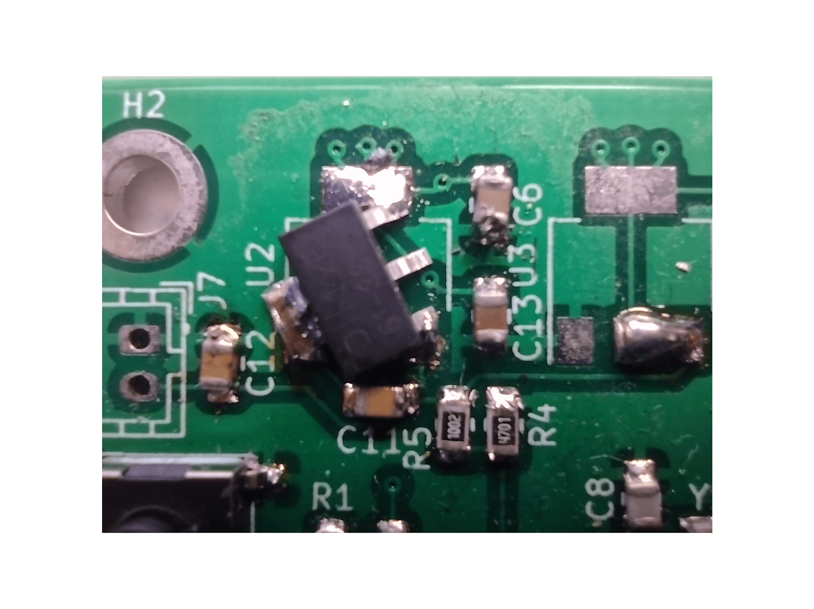
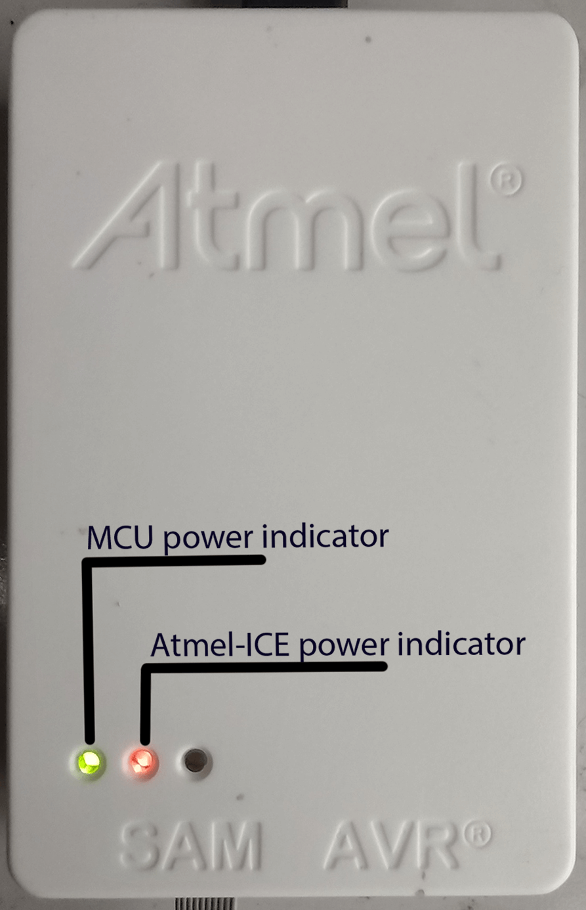
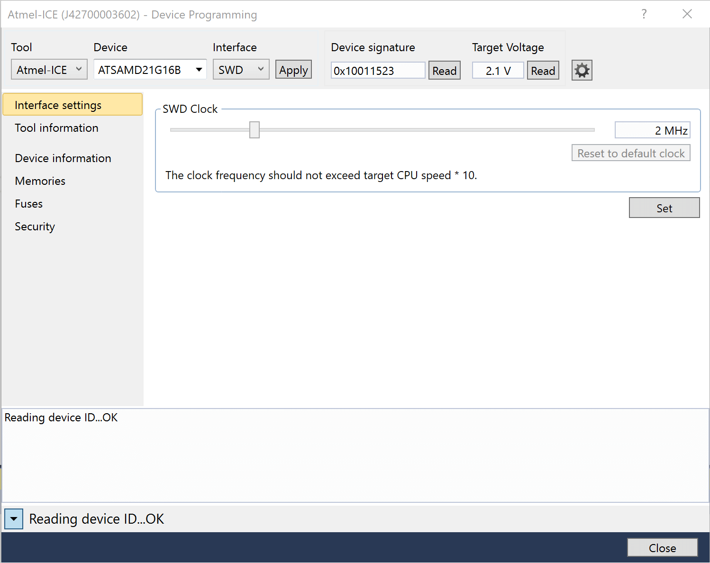
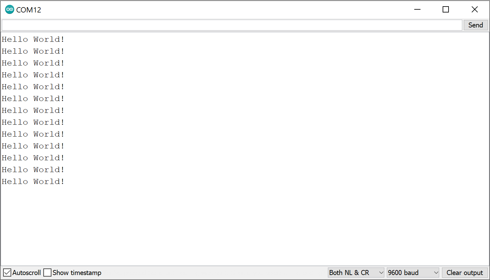
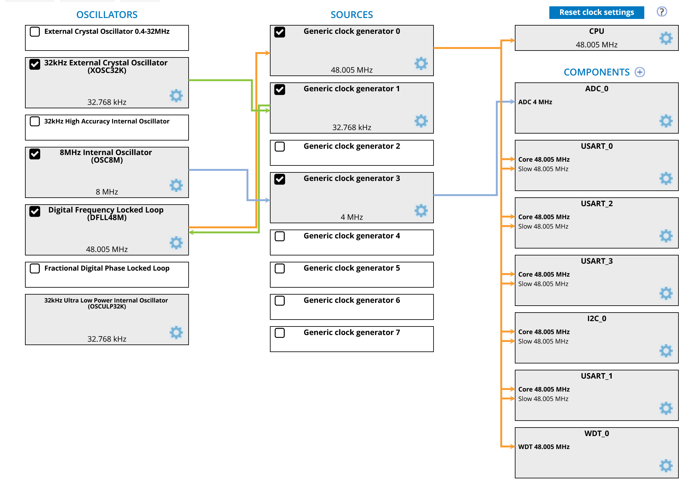
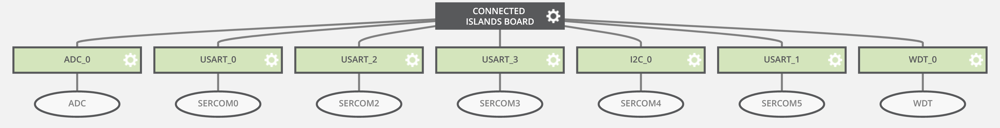

### 1. PCB Testing:

| Step                                           | Test result                                                                                                                                                                                                             | Maintainer    |
| ---------------------------------------------- | ----------------------------------------------------------------------------------------------------------------------------------------------------------------------------------------------------------------------- | ------------- |
| 1. Soldering PCB  Done by: Daan + Birk | The regulator that was used on the PCB is a different regulator than what the PCB was designed for, it has a different pinout. If the regulator is rotated by 240º the pinout will be correct.  (fig. 1.1)          | Daan Birk |
| 2. Microcontroller  Done by: Daan      | The microcontroller has been confirmed to be working using Atmel Studio 7 and Atmel-ICE programmer.  (fig 1.2.1 + fig 1.2.2)                                                                                        | Daan          |
| 3. LoraWAN  Done by: Birk              | The RN2483 has been confirmed to be working as expected by using an external Arduino to read the UART of the RN2483. The RN2483 has connected to TheThingsNetwork and has sucessfully sent test data. (fig 1.3) | Birk          |
| 4. UART and I2C  Done by: Birk + Daan  | Sending over UART works. Reading the UART does not work as expected yet. I2C has not been tested yet.                                                                                                           | Birk Daan |
| 5. Attach sensors                              | Not yet tested                                                                                                                                                                                                          | /             |

### 2. PCB Programming:

We have two different programers, an Atmel-ICE and a J-Link. We will be using the Atmel-ICE.

##### 2.1 Atmel-ICE:

| Step                                           | Test result                                                                                                                                                                                                                                                                                                                                                        | Maintainer |
| ---------------------------------------------- | ------------------------------------------------------------------------------------------------------------------------------------------------------------------------------------------------------------------------------------------------------------------------------------------------------------------------------------------------------------------ | ---------- |
| 1. Connecting Atmel-ICE  Done by: Birk | An ARM-JTAG 20-10 ADAPTER by olimex was used to connect the Atmel-ICE to the programming headers on the PCB. The adapter can be found here together with some shematics: https://www.olimex.com/Products/ARM/JTAG/ARM-JTAG-20-10/                                                                                                                                  | Birk       |
| 2. Atmel START  Done by: Daan          | The Atmel START file was configured step by step.  1. The SAMD21 was configured to work with the internal clock 2. The UART was configured and tested by reading Hello World from the UART pins (fig 2.3.1) 3. The external 32K Hz oscillator was configured (fig 2.3.2) 4. Atlast the rest of the pins and the RN2483 were configured (fig 2.3.3) | Daan       |
| 3. RN2483  Done by: Birk               | UART has been confirmed to be working as expected in step 2. The RN2483 uses UART as an interface to send commands. What has to be done in this step is figuring out a way to read the UART from the RN2483 using the SAMD21 and not an external arduino.                                                                                                      | Birk       |
| 4. I2C                                         | not yet programmed                                                                                                                                                                                                                                                                                                                                                 | /          |
| 5. Read data from sensors                      | not yet programmed                                                                                                                                                                                                                                                                                                                                                 | /          |

Fig 1.1

Fig 1.2.1

Fig 1.2.2

Fig 2.3.1

Fig 2.3.2

Fig 2.3.3

